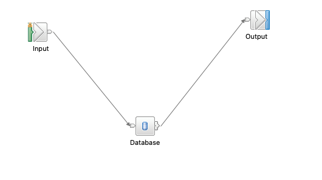

# Connecting ACE to Oracle DB using Database Node and Deploying it to CloudPak for Integration

This documentation is a summary of the steps to deploy a ace flow that receives a Rest request and uses database node to write it to a Oracle Database and deploy that flow on cloud pak for integration.

## Prerequisites

* Have a Oracle DB running (version 12.2.0.1 in our case).

* A common user account to access the database as `sysdba` or `sys` roles can't be passed.
  
* A table that you plan to Read or write to. In this tutorial we'll use these instructions to create a `Employees` table

    ```sql
    CREATE TABLE EMPLOYEES (PKEY INTEGER NOT NULL, FIRSTNAME VARCHAR(30), LASTNAME VARCHAR(30), COUNTRY VARCHAR(2), PRIMARY KEY(PKEY));

    INSERT INTO EMPLOYEES (PKEY, FIRSTNAME, LASTNAME, COUNTRY) VALUES(11, 'Raiyan', 'Islam', 'BD');

    Select * From Employees;

    commit work;
    ```

* An ACE `Rest API`  Project that has a post endpoint. It receives an employees json object. The project interchange file for this documentation could be found [here](./RestToOracleJDBC.zip).

* Download the client library from here <https://www.oracle.com/database/technologies/instant-client/linux-x86-64-downloads.html.> Drag and drop it to the project and you should see it under Other Resources.

## ACE Toolkit Steps

Create a POST rest api that takes an Employee JSON data in ace. Below is an example of the JSON data. 

```JSON
{
	"PrimaryKey": 5,
	"FirstName":"Ben",
	"LastName":"Thompson",
	"Country":"US"
}
```

To connect with ORACLE db, add a Database Node to the flow so it looks like this.



### Modifying the Database Node to insert into the database

Double click on your Database node and open up the ESQL code. Remove all the existing code and paste the following code in. Edit the necessary fields with the sample row you would like to enter.

```SQL
CREATE DATABASE MODULE Database_Database
	CREATE FUNCTION Main() RETURNS BOOLEAN
	BEGIN
		
		DECLARE MyRef REFERENCE TO Root.JSON.Data;
		DECLARE Source CHARACTER 'ORACLEDB';
		DECLARE DBSchema CHARACTER 'SYSTEM';				
		DECLARE DBTable  CHARACTER 'EMPLOYEES';
		INSERT INTO Database.{Source}.{DBSchema}.{DBTable} (PKEY, FIRSTNAME, LASTNAME, COUNTRY)
					VALUES( MyRef.PrimaryKey, MyRef.FirstName, MyRef.LastName, MyRef.Country );

		RETURN TRUE;
	END;

END MODULE;
```

That's it, we can just create the bar file now.


## ACE Custom Image

### Building the ACE Custom Docker Image

Create the following `Dockerfile`

```Dockerfile
FROM ibmcom/ace:latest
RUN . /opt/ibm/ace-11/server/bin/mqsiprofile
ENV PATH "$PATH:/opt/ibm/ace-11/common/jdk/jre/bin:/var/mqsi/extensions/11.0.0/server/bin:/var/mqsi/extensions/11.0.0/bin:/opt/ibm/ace-11/server/bin/mosquitto:/opt/ibm/ace-11/server/bin:/opt/ibm/ace-11/common/node/bin:/opt/ibm/ace-11/tools"
ENV MQSI_WORKPATH "/var/mqsi"
USER root
RUN microdnf install yum
ADD https://download.oracle.com/otn_software/linux/instantclient/19600/oracle-instantclient19.6-basic-19.6.0.0.0-1.x86_64.rpm /home/oracle_instant.rpm
RUN yum -y install /home/oracle_instant.rpm
ENV LD_LIBRARY_PATH=/usr/lib/oracle/19.6/client64/lib
USER aceuser
```

Now to can build the image using this `Dockerfile`. Simply run

```
docker build . -t ace-oracle-odbc:1.0
```

### Deploying the Custom image

Login to OpenShift through the command line. Make sure that you are in the correct namespace/project as your deployed ACE Dashboard instance. By default in most cases the ACE Dashboard pods are usually installed in the `ace` namespace. In my case, I used the `ace` namespace. To check your current namespace use the `oc project` command. If you aren't in the correct namespace you can change this by using the `oc project ace` command as shown below. Your generated image pull secret and server configuration secrets (which we will generate a bit further down) need to be in the same namespace.

```bash
oc project ace

docker login $(oc registry info) -u admin -p $(oc whoami -t)

docker tag ace-oracle-odbc:1.0 default-route-openshift-image-registry.apps.ocp43.vg.gse-ocp.net/ace/ce-oracle-odbc:1.0-amd64

docker push default-route-openshift-image-registry.apps.ocp43.vg.gse-ocp.net/ace/ce-oracle-odbc:1.0-amd64

```

Create a secret to access this custom image kubectl create secret docker-registry <secret-name> --docker-username=$(oc whoami) --docker-password=$(oc whoami -t) --docker-server=image-registry.openshift-image-registry.svc:5000

For example,

```bash
oc project ace

oc create secret docker-registry internal-reg --docker-username=$(oc whoami) --docker-password=$(oc whoami -t) --docker-server=image-registry.openshift-image-registry.svc:5000

```

## Deploy the bar file

Go to your CP4I ace dashboard

* Click Create Server -\> Click Add a bar file


Go to your workspace -\> BARfiles -\> Select kafkaToMongoDB.bar -\>
Click Continue


* Download configuration package on your desktop


* In the `odbc.ini` file, paste the following and replace the hostname andd port. Also make sure `SID` and `ServiceName` is correct.

```
;#######################################
;#### List of data sources stanza ######
;#######################################
[ODBC Data Sources]
ORACLEDB=Oracle ODBC Driver
;###########################################
;###### Individual data source stanzas #####
;###########################################
;# Oracle Server Stanza
[ORACLEDB]
Driver=/opt/ibm/ace-11/server/ODBC/drivers/lib/UKora95.so
Description=Oracle12c DB running on an OCP cluster
HostName=<IP ADDRESS>
Port=<PORT>
SID=ORCLCDB
ServiceName=ORCLCDB.localdomain
CatalogOptions=0
EnableStaticCursorsForLongData=0
ApplicationUsingThreads=1
EnableDescribeParam=1
OptimizePrepare=1
WorkArounds=536870912
ProcedureRetResults=1
ColumnSizeAsCharacter=1
LoginTimeout=15
EnableNcharSupport=0
;##########################################
;###### Mandatory information stanza ######
;##########################################
[ODBC]
InstallDir=/opt/ibm/ace-11/server/ODBC/drivers
UseCursorLib=0
IANAAppCodePage=4
UNICODE=UTF-8
```

* Create a secret
  - Go to openshift and copy the login command
  - Login to openshift through command line
  - Go to the "config" directory through command line

Make sure you are in the same namespace/project as your deployed ACE Dashboard and your custom image.

RUN ./generateSecrets.sh \<secret-name>

For example,
```
oc project ace

./generateSecrets.sh ace-odbc-secret
```

Go back to CP4I


Select Toolkit and click Next


Name: ace-oracle

Turn show everything option to ON

Uncheck production usage

Use the custom image for ace only

```
image-registry.openshift-image-registry.svc:5000/ace/ace-oracle-odbc:1.0
```

Since the image is going to be pulled internally in the cluster the endpoint that should be used is `image-registry.openshift-image-registry.svc:5000`. The registry endpoint that we initially docker logged into and pushed to was for external use (i.e. when docker pushing into it).

Again, please make sure that your custom image and your pull secret were created in the same namespace/project as your deployed ACE Dashboard instance.

Image pull secret: `internal-reg`
Name of the secret that contains the server configuration: `ace-odbc-secret`
Drop the replica count to 1
And leave rest the same


Now click create and it should start the deployment.

### Test

Open the server named ace-oracle on ace dashboard and get the URL 


create data.json with the following:

```json
{
	"PrimaryKey": 5,
	"FirstName":"Ben",
	"LastName":"Thompson",
	"Country":"US"
}
```

```
curl -X POST <url>/employees -d @data.json

Example:
curl -X POST http://kafka-mongodb-http-ace.apps.ocp43.vg.gse-ocp.net/example/v1/employees -d @data.json

```

or you can test using postman.
