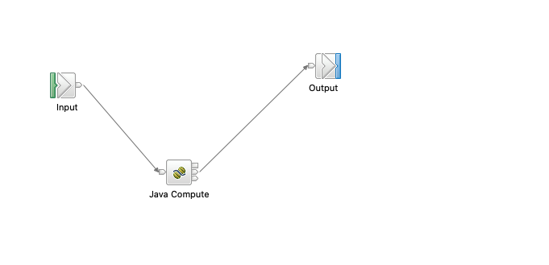
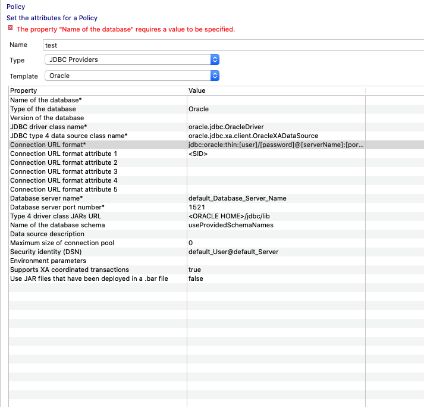
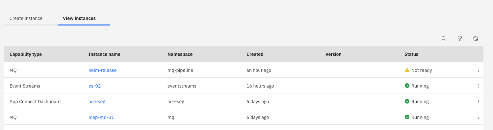
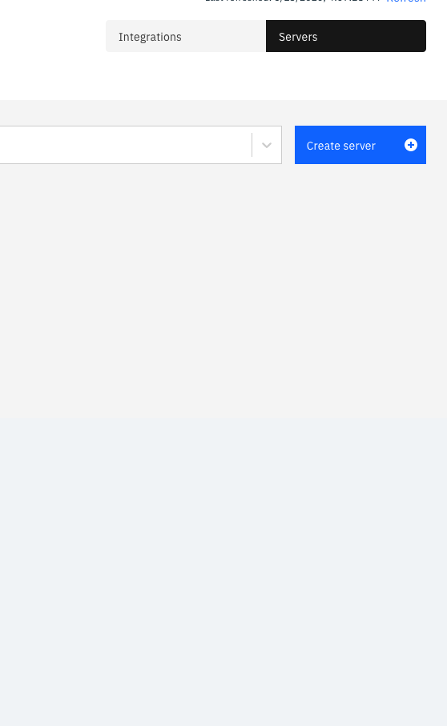
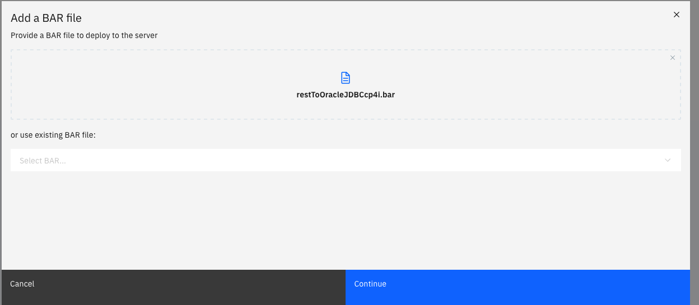
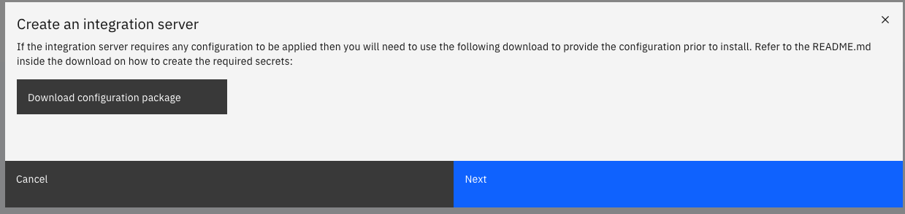
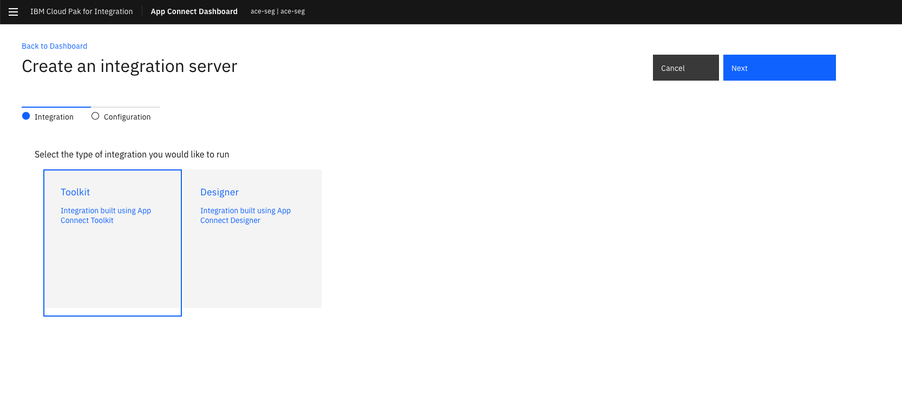
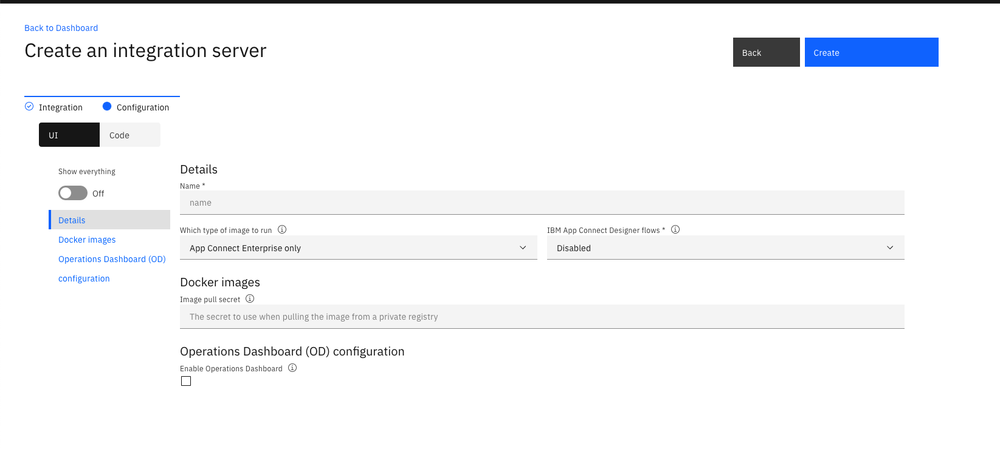
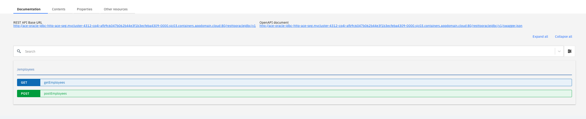

# Connecting ACE to Oracle DB and Deploying it to CloudPak for Integration

This documentation is a summary of the steps to deploy a ace flow that receives a Rest request and uses java compute node to write it to a Oracle Database and deploy that flow on cloud pak for integration.

## Prerequisites

* Have a Oracle DB running (version 12.2.0.1 in our case).

* A common user account to access the database as `sysdba` or `sys` roles can't be passed.
  
* A table that you plan to Read or write to. In this tutorial we'll use these instructions to create a `Employees` table

    ```sql
    CREATE TABLE EMPLOYEES (PKEY INTEGER NOT NULL, FIRSTNAME VARCHAR(30), LASTNAME VARCHAR(30), COUNTRY VARCHAR(2), PRIMARY KEY(PKEY));

    INSERT INTO EMPLOYEES (PKEY, FIRSTNAME, LASTNAME, COUNTRY) VALUES(11, 'Raiyan', 'Islam', 'BD');

    Select * From Employees;

    commit work;
    ```

* An ACE `Rest API`  Project that has a post endpoint. It receives an employees json object. The project interchange file for this documentation could be found [here](./RestToOracleJDBC.zip).

* Download the client library from here <https://www.oracle.com/database/technologies/instant-client/linux-x86-64-downloads.html.> Drag and drop it to the project and you should see it under Other Resources.

## ACE Toolkit Steps

Create a POST rest api that takes an Employee JSON data in ace. Below is an example of the JSON data. 

```JSON
{
	"PrimaryKey": 5,
	"FirstName":"Ben",
	"LastName":"Thompson",
	"Country":"US"
}
```

To connect with ORACLE db, add a Java Compute Node to the flow so it looks like this.



### Making the connection in Java Compute

Double Click on the Java Compute Node, and it should have a few empty empty (e.g. `evaluate(), onSetup()`). We only care about the `evaluate()` method for connecting with Oracle which will have some skeleton code. Replace that method the following code block.

```Java

public void evaluate(MbMessageAssembly inAssembly) throws MbException {
		MbPolicy myUserPolicy = getPolicy("UserDefined", "{MyPolicyProject}:ORCLCDB");
		MbOutputTerminal out = getOutputTerminal("out");
		MbMessage inMessage = inAssembly.getMessage();
	    // create new message
	    MbMessage outMessage = new MbMessage(inMessage);
	    MbMessageAssembly outAssembly = new MbMessageAssembly(inAssembly,outMessage);
		try {

			// Obtain a java.sql.Connection using a JDBC Type4 datasource
	        // This example uses a Policy of type JDBCProviders called "MyOracleJDBCPolicy" in Policy Project "MyPolicies"  
	        Connection conn = getJDBCType4Connection("{MyPolicies}:MyOracleJDBCPolicy", JDBC_TransactionType.MB_TRANSACTION_AUTO);
	        // Example of using the Connection to create a java.sql.Statement 
	        Statement stmt = conn.createStatement(ResultSet.TYPE_SCROLL_INSENSITIVE, ResultSet.CONCUR_READ_ONLY);
	        MbElement dataElement = inMessage.getRootElement().getLastChild().getFirstChild();
	        // Executes the given SQL statement, which may be an INSERT, UPDATE, or DELETE statement
	        stmt.executeUpdate("INSERT INTO EMPLOYEES (PKEY, FIRSTNAME, LASTNAME, COUNTRY) VALUES("
	        		+ dataElement.getFirstElementByPath("PrimaryKey").getValueAsString() + ","
	        		+ "'" + dataElement.getFirstElementByPath("FirstName").getValueAsString() + "',"
	        		+ "'" + dataElement.getFirstElementByPath("LastName").getValueAsString() + "',"
	        		+ "'" + dataElement.getFirstElementByPath("Country").getValueAsString() + "'"
       		+")");
		} catch (MbException e) {
			// Re-throw to allow Broker handling of MbException
			throw e;
		} catch (RuntimeException e) {
			// Re-throw to allow Broker handling of RuntimeException
			throw e;
		} catch (SQLException sqx) {
			// Consider replacing Exception with type(s) thrown by user code
			// Example handling ensures all exceptions are re-thrown to be handled in the flow
			throw new MbUserException(this, "evaluate()", "", "", sqx.toString(), null);
		}
		out.propagate(outAssembly);
	}
```

The comments explain what each line of code do for the most part. But in short the code creates a connection to the database, inserts the data that came in from the json body and propagate the output as a response.

### Creating the Policy

In this example, a policy is used to pass in the database connection information to the flow. In ace, go to `File -> New -> Policy`. Create the Policy project and give the polic a name. In this exmaple, the project is `MyPolicies` and the name of the policy is `MyOracleJDBCPolicy`. It looks like this.



So the fields that have to be specified are

* Type: JDBC Providers

* Template: Oracle (Changing the template will autofill some of the fields like JDBC Driver Class or data source class name.

* Connection URL Format: `jdbc:oracle:thin:[user]/[password]@[serverName]:[portNumber]:[connectionUrlFormatAttr1]` (e.g. `jdbc:oracle:thin:c##ace_user/passw0rd@3.134.247.135:32769:ORCLCDB`)

* Database Server name: IP address/dns name
* Database SErver port number: portNumber
* Type 4 driver class JARs URL: The url of the jar file or the location of the jar file if you ship the jar file with the bar file.
* Security Identity: It's the identity that we will create using generateSecret.sh script during deployment. 
* Use JAR Files that have been deployed in a bar file: By default it is false, set it to true if you want to ship it. In this example, we'll set it to `true`.

At this point we can create the bar file. Note: **The policy must be included in the bar file**

## Deploying on CP4I

The deployment steps is very similar to a regular deployment steps but we just have to do somethings different when creating th secret. 

* Go to Cloud Pak for Integration Platform Home and select `View Instances`. Itt should show something like this. Select your ace dashboard, in this case `ace-sever`. 

* From ace dahsboard select `Create Server`.


* Select the barfile that you created previously. Hit continue. .

* You'll see this popup. Download the Configuration File and click Next. 

* Now extract the config file. There is a Readme file which explains how to configure it. But what we are interested in is `policy.xml` and `setdbparams.txt`.
  
* In policy.xml, we'll paste in the contents of `MyOracleJDBCPolicy.xml` from ACE Toolkit. Easiest way to do so is to right click on `MyOracleJDBCPolicy.xml` and select `Open With -> Text Editor`. Copy and paste the raw xml from there to `policy.xml`.

* In setdbparams.txt we'll paste in the identity information so that the previously mentioned `Security Identity` is created. Paste in the following line witout any newline and space at the end. Replace `c##ace_user` with your username and `passw0rd` with your password.

  ```
  jdbc::mydbidentity c##ace_user passw0rd
  ```

* Now we'll run generateSecret.sh. Note: **Make sure you are logged into openshift from the terminal. Typing  `oc whoami` should return your openshift username if you are logged in**
  
  ```bash
  ./generateSecrets.sh my-secret # my-secret is the name of your secret.
  ```

* Now go back to browser. You should be in the following page. Select Toolkit, hit next. 
* You should see the Configuration page. Toggle `Show everything` 
* Now we'll have to change the follwoing fields.
  * Details->Name: name of your deployment e.g. `ace_oracle_jdbc`
  * Docker Images -> Image pull secret: Your entitlement key
  * Integration server -> Name of the secret that contains the server configuration: the secret you created using generateSecret.sh
  * Configuration for deployments -> Replica count:  We recommend 1 for non production workloads.
* That's it. Hit create. Once the deployment is done, you'll see the server in dashboard. 
* Select the server, and then select your reest api. you'll see something like this. 
* Now if you send a post request to the `REST API Base URL/employees` it will write it to the database.
